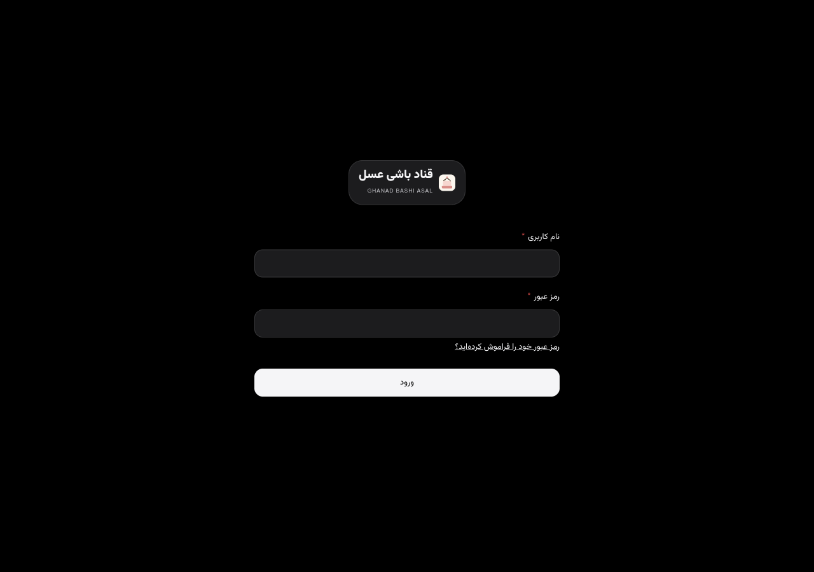
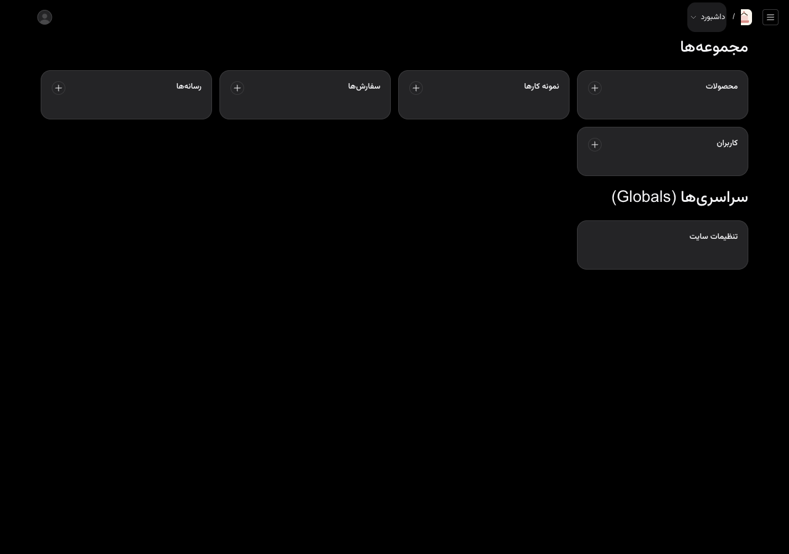
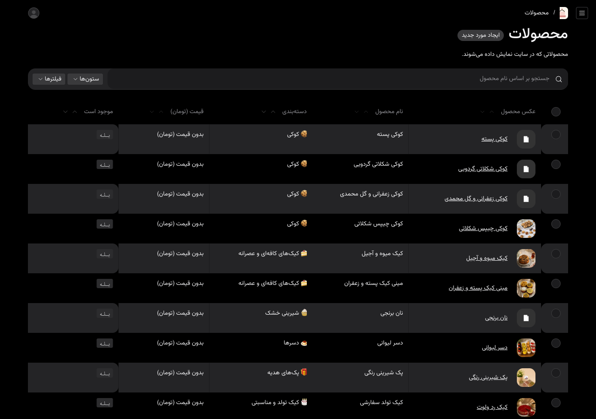
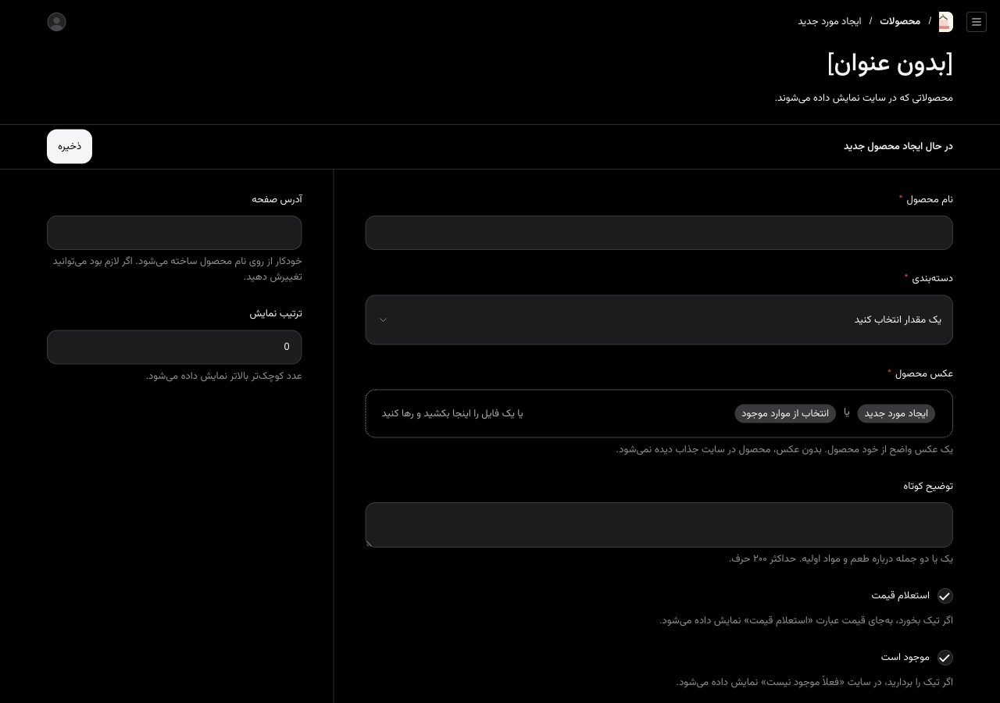
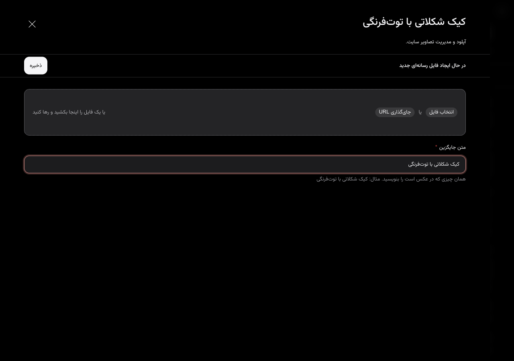
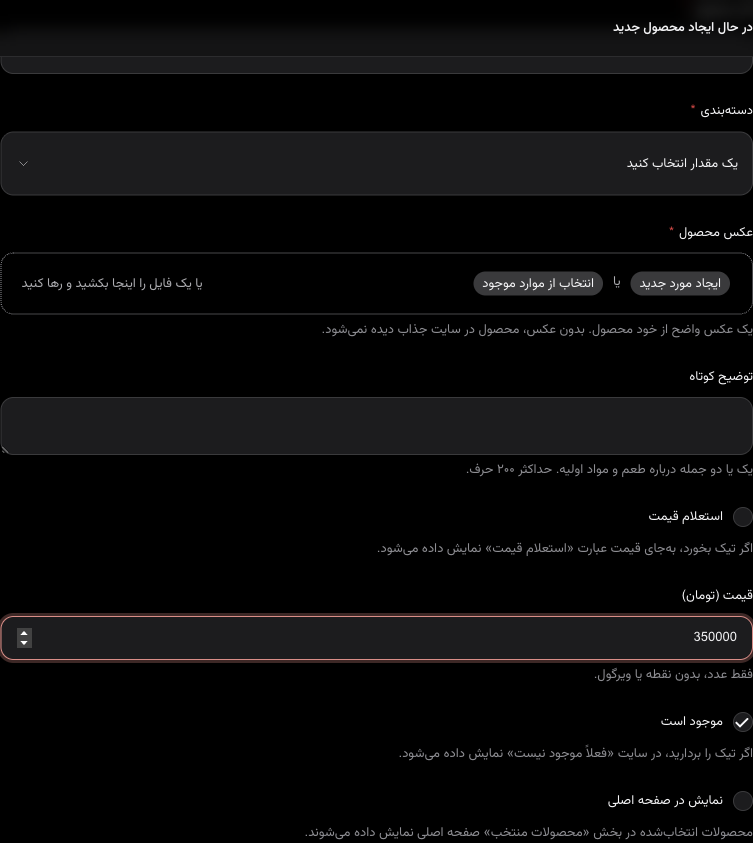
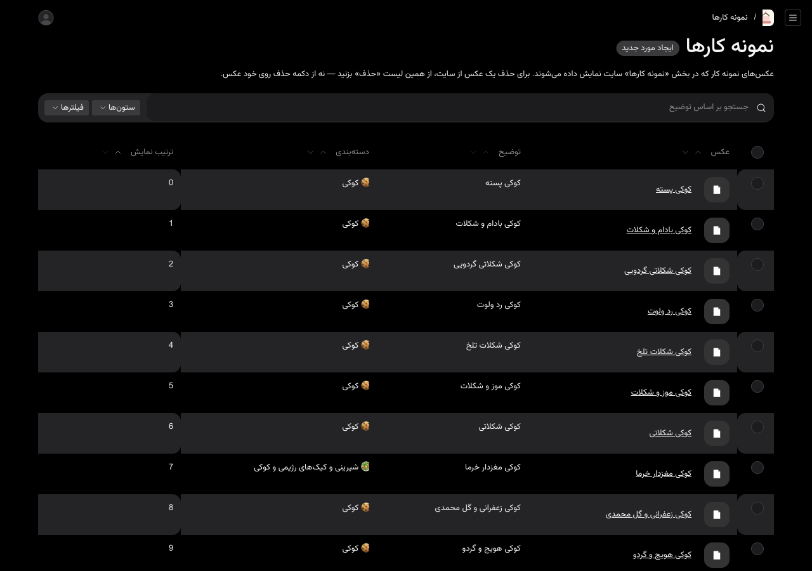
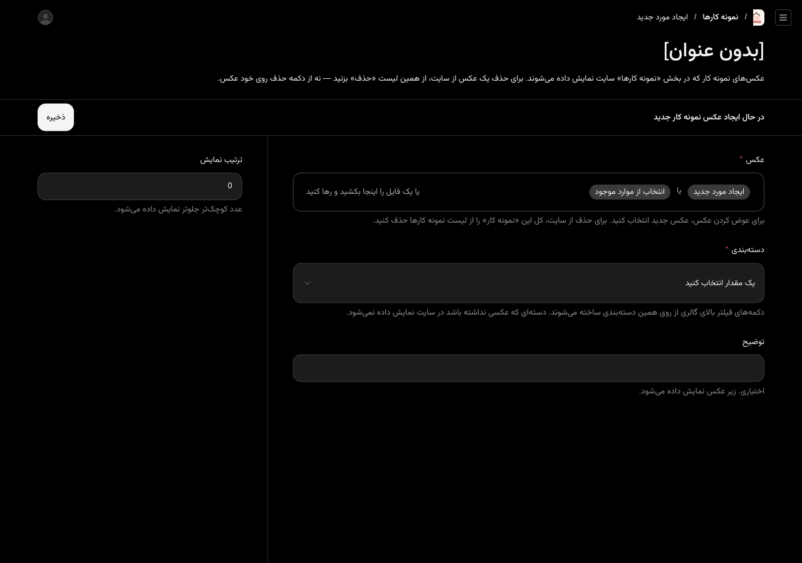
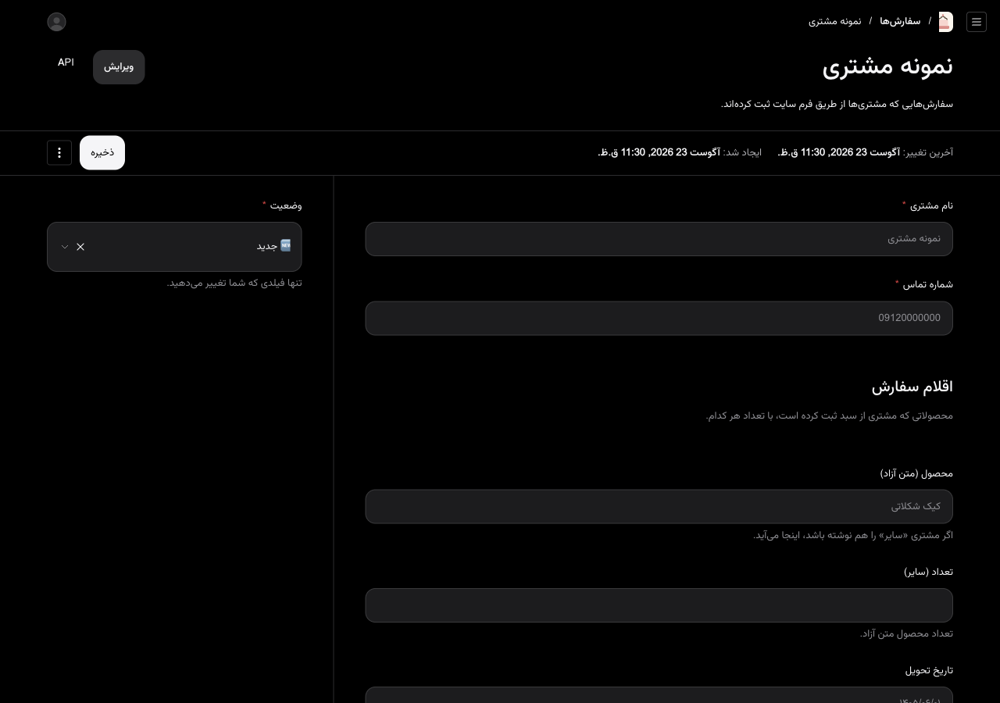

# راهنمای مدیریت سایت قناد باشی عسل

با این راهنما خودتان محصولات، قیمت‌ها، عکس‌ها، سفارش‌ها و شماره تماس را عوض می‌کنید. لازم نیست برای این کارها به کسی پیام بدهید.

آدرس ورود: [ghanadbashi.vercel.app/admin](https://ghanadbashi.vercel.app/admin)

نام کاربری و رمز عبور برایتان جداگانه فرستاده می‌شود. آن‌ها را به کسی نگویید.

بعد از هر ذخیره، حدود یک دقیقه صبر کنید و سایت را از نو باز کنید تا تغییر را ببینید.

---

## ۱. ورود به پنل

1. در گوشی یا رایانه، این آدرس را باز کنید: `ghanadbashi.vercel.app/admin`
2. **نام کاربری** را بنویسید (نه شماره تلفن)
3. **رمز عبور** را بنویسید
4. روی **ورود** بزنید

اگر صفحه بالا نیامد، اینترنت را چک کنید و دوباره همان آدرس را باز کنید.

بعد از ورود، این صفحه را می‌بینید:

از منوی راست همین چهار جا را لازم دارید:

| کجا بروید | برای چه کاری |
| --- | --- |
| **محصولات** | اضافه کردن، قیمت، تمام‌شدن کالا |
| **نمونه کارها** | عکس‌های گالری سایت |
| **سفارش‌ها** | دیدن سفارش مشتری و عوض کردن وضعیت |
| **تنظیمات سایت** | شماره تماس، واتساپ، اینستاگرام |

به **کاربران** و **رسانه‌ها** دست نزنید.

برای خروج، پایین منو روی **خروج** بزنید.

---

## ۲. اضافه کردن محصول جدید

1. از منوی راست روی **محصولات** بزنید
2. بالا سمت چپ روی **ایجاد محصول جدید** بزنید

3. **نام محصول** را بنویسید — همان اسمی که مشتری باید ببیند
4. **دسته‌بندی** را انتخاب کنید
5. برای عکس، روی **ایجاد مورد جدید** بزنید
6. روی **انتخاب فایل** بزنید و عکس را از گوشی انتخاب کنید
7. **متن جایگزین** را پر کنید — پایین همین صفحه توضیح داده شده
8. روی **ذخیره** داخل پنجره عکس بزنید
9. **توضیح کوتاه** را بنویسید؛ یک یا دو جمله کافی است
10. اگر قیمت مشخص است، تیک **استعلام قیمت** را بردارید و عدد را بنویسید
11. تیک **موجود است** را بگذارید بماند
12. اگر می‌خواهید در ردیف «محصولات منتخب» صفحه اول بیاید، **نمایش در صفحه اصلی** را تیک بزنید
13. **آدرس صفحه** را دست نزنید؛ خودش پر می‌شود
14. روی **ذخیره** بزنید

### متن جایگزین — این یکی را خالی نگذارید

بدون این نوشته، عکس ذخیره نمی‌شود و کار همان‌جا می‌ایستد.

همان چیزی که در عکس است را بنویسید.

مثال درست: `کیک شکلاتی با توت‌فرنگی`

مثال غلط: `عکس` یا `۱` یا `asdf`

---

## ۳. تغییر قیمت یک محصول

1. **محصولات** را باز کنید
2. روی نام همان محصول بزنید
3. اگر تیک **استعلام قیمت** خورده، آن را بردارید تا کادر قیمت ظاهر شود
4. در **قیمت (تومان)** فقط عدد بنویسید — بدون نقطه، ویرگول یا کلمه «تومان»
5. مثال: برای سیصد و پنجاه هزار تومان بنویسید `350000`
6. روی **ذخیره** بزنید

---

## ۴. وقتی قیمت مشخص نیست — «استعلام قیمت»

اگر هنوز قیمت را تعیین نکرده‌اید، یا هر بار فرق می‌کند:

1. محصول را باز کنید
2. تیک **استعلام قیمت** را بزنید
3. کادر قیمت ناپدید می‌شود و در سایت نوشته می‌شود «استعلام قیمت»
4. **ذخیره** کنید

بعداً که قیمت را دانستید، تیک را بردارید و عدد را بگذارید.

---

## ۵. پنهان کردن محصولی که تمام شده

محصول را پاک نکنید. فقط از دید مشتری پنهانش کنید:

1. محصول را باز کنید
2. تیک **موجود است** را بردارید
3. **ذخیره** کنید

در سایت نوشته می‌شود «فعلاً موجود نیست» و از فرم سفارش هم کنار می‌رود. هر وقت دوباره آماده شد، همان تیک را برگردانید.

---

## ۶. اضافه کردن عکس به گالری

1. از منوی راست روی **نمونه کارها** بزنید
2. روی **ایجاد مورد جدید** بزنید

3. عکس را مثل محصول بارگذاری کنید و **متن جایگزین** را بنویسید
4. **دسته‌بندی** را انتخاب کنید — دکمه فیلتر بالای گالری از روی همین ساخته می‌شود
5. **توضیح** اختیاری است؛ زیر عکس در سایت دیده می‌شود
6. **ذخیره** کنید

برای حذف یک عکس از سایت، از همین فهرست روی آن بزنید و کل نمونه کار را حذف کنید. روی خودِ عکس دکمه حذف نزنید.

---

## ۷. دیدن سفارش‌ها و تغییر وضعیت

1. از منوی راست روی **سفارش‌ها** بزنید
2. روی نام مشتری بزنید
3. نام، شماره، تاریخ تحویل و توضیح را بخوانید — این‌ها را عوض نکنید
4. فقط **وضعیت** را عوض کنید (سمت چپ صفحه)
5. **ذخیره** کنید

معنی وضعیت‌ها:

| وضعیت | یعنی |
| --- | --- |
| 🆕 جدید | تازه آمده؛ هنوز جواب نداده‌اید |
| ✅ تأیید شده | با مشتری هماهنگ کرده‌اید |
| 📦 تحویل شده | کار تمام شده |
| ❌ لغو شده | سفارش انجام نمی‌شود |

سفارش جدید از داخل پنل نسازید. سفارش فقط از فرم سایت مشتری می‌آید.

---

## ۸. تغییر شماره تماس، واتساپ و اینستاگرام

1. از منوی راست روی **تنظیمات سایت** بزنید
2. صفحه را پایین بکشید تا برسید به **اطلاعات تماس**
3. هر کدام را که لازم است عوض کنید:

| نام کادر | چطور بنویسید |
| --- | --- |
| **شماره تماس** | همان شماره‌ای که مشتری برای تماس می‌بیند، مثلاً `09369088311` |
| **شماره واتساپ** | با کد ایران و **بدون صفر اول**. مثال درست: `989369088311` |
| **آیدی اینستاگرام** | بدون علامت `@`. مثال: `ghanad_bashi_asal5` |
| **محدوده فعالیت** | مثلاً `اصفهان، بهارستان و حومه` |

4. روی **ذخیره** بزنید

اگر واتساپ را با صفر بنویسید (`0936…`)، دکمه واتساپ سایت برای مشتری کار نمی‌کند.

نام برند، شعار و متن «درباره من» را هم از همین صفحه می‌توانید عوض کنید. اگر مطمئن نیستید، دست نزنید.

---

## ۹. عکس خوب چه ویژگی‌هایی دارد؟

- در نور روز گرفته شده باشد؛ لامپ زرد شب عکس را کدر می‌کند
- تقریباً مربع باشد — گوشی را عمودی نزدیک بگیرید، نه از خیلی دور
- حجمش کمتر از **۴ مگابایت** باشد. اگر سایت خطا داد، از برنامه گوشی کیفیت را کم کنید و دوباره بفرستید
- خود محصول در وسط باشد، نه میز خالی یا دست

و **متن جایگزین** را همیشه بنویسید: همان چیزی که در عکس است.

---

## ۱۰. اگر مشکلی پیش آمد

اول این‌ها را امتحان کنید؛ معمولاً یکی‌شان کافی است:

1. صفحه را ببندید و همان آدرس پنل را دوباره باز کنید
2. **خروج** بزنید و با همان نام کاربری دوباره وارد شوید
3. اینترنت گوشی را یک‌بار خاموش و روشن کنید
4. از وای‌فای به اینترنت همراه بروید، یا برعکس
5. اگر عکس بالا نمی‌رود، حجمش را کم کنید و **متن جایگزین** را خالی نگذارید

اگر بعد از این پنج کار هنوز گیر کردید، همان‌وقت پیام بدهید و بگویید کدام صفحه بود و چه دکمه‌ای را زدید.

کارهایی که خودتان از عهده‌اش برمی‌آیید و لازم نیست پیام بدهید: قیمت، موجود بودن، عکس جدید، متن درباره من، شماره تماس، دیدن سفارش.

کارهایی که بعداً جداگانه حساب می‌شود: صفحه جدید، شکل تازه برای سایت، پرداخت آنلاین.
